# Indikatorenportal Statistisches Amt Basel-Stadt

Statistische Indikatoren des Kantons Basel-Stadt finden und darstellen. Live-Version: [statistik.bs.ch/indikatorenportal](https://statistik.bs.ch/indikatorenportal/).

## Inhalt

- [Ansichten und Seiten](#ansichten-und-seiten)
- [Lokale Installation](#lokale-installation)
- [Entwicklung starten](#entwicklung-starten)
- [Projektstruktur](#projektstruktur)
- [Daten, Metadaten und Charts pflegen](#daten-metadaten-und-charts-pflegen)
- [Neue Charts erstellen](#neue-charts-erstellen)
- [Anwendung lokal bauen](#anwendung-lokal-bauen)
- [Was macht der Build-Prozess?](#was-macht-der-build-prozess)
- [Charts vom FTP-Server aktualisieren](#charts-vom-ftp-server-aktualisieren)
- [Charts aus dem "Umweltbericht beider Basel" übernehmen](#charts-aus-dem-umweltbericht-beider-basel-übernehmen)
- [PNG/PDF-Export pro Indikatorenset](#pngpdf-export-pro-indikatorenset)
- [Vorschaubilder manuell erzeugen](#vorschaubilder-manuell-erzeugen)
- [URL-Parameter](#url-parameter)
- [Bekannte Highcharts-12-Kompatibilitätsthemen](#bekannte-highcharts-12-kompatibilitätsthemen)
- [Abhängigkeiten aktualisieren](#abhängigkeiten-aktualisieren)
- [Entwicklung in einem privaten GitHub-Repository](#entwicklung-in-einem-privaten-github-repository)
- [Entwicklung mit Cloud9](#entwicklung-mit-cloud9)
- [Lizenzierung](#lizenzierung)

## Ansichten und Seiten

- **`index.html`** – Das Portal: durchsuchbare, filterbare Übersicht aller Indikatoren. Bietet drei Ansichtsoptionen (oben rechts umschaltbar): **Kachelansicht**, **Tabellenansicht** (Titel, Untertitel, Thema, Unterthema, Publikationsdatum ohne Vorschaubild) sowie eine **Listenansicht**, die aktuell im UI ausgeblendet ist, deren Funktionalität aber vollständig erhalten bleibt (siehe `assets/js/indikatoren-filter.js`, `portalViewMode`).
  - Standardmässig werden 32 Indikatoren geladen; über den Button "Alle anzeigen" werden weitere nachgeladen. Alle Metadaten sind dabei bereits vollständig im Browser vorhanden – die Begrenzung betrifft nur die gerenderten Kacheln, nicht die in der Lightbox verfügbaren Indikatoren.
  - Klick auf einen Indikator öffnet die **Lightbox** (`assets/js/lightbox.js`) mit Chart, Lesehilfe, Erläuterungen und Links; Navigation mit Pfeiltasten oder den Pfeil-Buttons durch alle gefilterten Indikatoren.
  - Mit dem Parameter `Indikatorenset` wechselt die Seite in die **Indikatorenset-Ansicht** (siehe [URL-Parameter](#url-parameter)).
- **`chart-details.html`** – Einzelner Indikator als eigenständige oder eingebettete Seite (`?id=…`). Mit `hideHeader=false` erscheint der Kopfbereich und der Inhalt wird wie der Rest der Seite in einem `.container` dargestellt (für die eigenständige Nutzung); mit `hideHeader=true` (Standard für Einbettung via iframe) nimmt der Inhalt die volle Breite ein.
- **`chart.html`** – Ähnlich wie `chart-details.html`, dient v. a. als Einbettungsziel innerhalb der Portal-/Indikatorenset-Ansicht und für den Vorschaubild-Export.
- **`chart-dev.html`** – Minimalseite zum isolierten Entwickeln/Testen eines einzelnen Charts, ohne den restlichen Portal-Code zu laden.
- **`print.html`** – Erzeugt PNG/PDF-Dateien aller Charts eines Indikatorensets zum Download (siehe [PNG/PDF-Export](#pngpdf-export-pro-indikatorenset)).
- **`thumbnails.html`, `all.html`** – Hilfsseiten zum manuellen Erzeugen bzw. Durchblättern aller Vorschaubilder im Browser.

## Lokale Installation

[Node.js](https://nodejs.org) installieren, danach im Projektverzeichnis:

```shell
npm install
```

## Entwicklung starten

Lokalen Server starten (Port 8084, zeigt den aktuellen, bereits gebauten Stand):

```shell
npm run local-server
```

Für Änderungen an Layout/Styling zusätzlich in einem zweiten Terminal den Tailwind-Watcher laufen lassen – er kompiliert `tailwind/tailwind.css` fortlaufend nach `assets/css/tailwind.css`. Dieser Schritt ist **nicht** Teil von `npm run build` und muss während der Entwicklung separat laufen:

```shell
npm run build:tailwind:watch
```

Nach Änderungen an Daten, Metadaten oder Chart-Konfigurationen die Anwendung neu bauen (siehe [Anwendung lokal bauen](#anwendung-lokal-bauen)).

## Projektstruktur

| Pfad | Inhalt |
| --- | --- |
| `metadata/single/[id].json` | Metadaten eines Indikators (Titel, Untertitel, Lesehilfe, Erläuterungen, Quellenangabe, Thema/Unterthema, Kennzahlenset, Template, …). Quelle der Wahrheit – wird von Hand oder per Import gepflegt. |
| `data/[id].tsv` | Rohdaten des Indikators als Tab-separierte Datei. |
| `charts/templates/[id].js` | Chart-spezifische Highcharts-Optionen eines einzelnen Indikators (Serienfarben, Tooltips, individuelle Legenden-Positionierung usw.), zusammengeführt mit dem Basis-Template. |
| `charts/templates/[template].js` | Basis-Templates (z. B. `line001`, `map001`, `mappie001`, `spider001`, …), gemeinsam genutzt von mehreren Indikatoren. Siehe [Neue Charts erstellen](#neue-charts-erstellen) für die vollständige Übersicht. |
| `charts/configs/portal/[id].json` | **Generiert** durch `npm run build:charts` – fertig zusammengeführte Highcharts-Konfiguration pro Indikator. Nicht von Hand bearbeiten, sondern die Quelldateien (Daten/Metadaten/Template) anpassen und neu bauen. |
| `images/portal/[id].svg` | **Generiert** durch `npm run build:images` – statisches Vorschaubild für Kachel-/Listenansicht. Nicht von Hand bearbeiten. |
| `metadata/all/`, `metadata/portal/`, `metadata/sets/` | **Generiert** durch `npm run build:database` / `build:partial_databases` – aggregierte Metadaten-Datenbanken für Portal- bzw. Indikatorenset-Ansicht. |
| `assets/js/indikatoren-highcharts.js` | Zentrale Rendering-Logik: lädt Template + Chart-Konfiguration + Daten, merged sie und erstellt den Highcharts-Chart. Enthält auch die Highcharts-12-Kompatibilitäts-Patches (siehe unten). |
| `assets/js/indikatoren-filter.js` | Filter-, Such-, Sortier- und Ansichtslogik des Portals (basiert auf `FilterJS`). |
| `assets/js/lightbox.js` | Lightbox-/Detailansicht im Portal inkl. Navigation zwischen Indikatoren. |
| `tailwind/` | Tailwind-Quell-CSS und Komponenten; wird zu `assets/css/tailwind.css` kompiliert. |
| `build/` | Node.js-Build-Skripte, siehe [Was macht der Build-Prozess?](#was-macht-der-build-prozess). |
| `tmp/chartsToBuild.json` | Von `build:find_changed_charts` befüllte bzw. manuell setzbare Liste von Indikator-IDs, die beim nächsten `build:charts`/`build:images`-Lauf verarbeitet werden. Nicht versioniert. |

## Daten, Metadaten und Charts pflegen

### Daten hinzufügen/aktualisieren

TSV-Datei mit dem Namen `[id].tsv` in den Ordner `data/` kopieren.

### Metadaten hinzufügen/aktualisieren

JSON-Datei mit dem Namen `[id].json` in den Ordner `metadata/single/` kopieren, danach lokal bauen (siehe unten), damit die aggregierten Metadaten-Datenbanken aktualisiert werden.

### Chart-Konfiguration hinzufügen/aktualisieren

Datei `[id].js` in den Ordner `charts/templates/` kopieren. Sie muss eine [self-invoking function](https://en.wikipedia.org/wiki/Immediately-invoked_function_expression) enthalten, die ein JavaScript-Objekt mit den Abweichungen vom Basis-Template zurückgibt – mindestens der Knoten `series` wird benötigt.

### Kennzahlensets für Print initialisieren

Für ein neues Print-Kennzahlenset können Daten und Chart-Konfigurationen vom jeweiligen Eltern-Kennzahlenset übernommen werden:

1. Metadaten-Dateien nach `metadata/single/` hochladen.
2. Ausführen:
   ```shell
   npm run build:init_print_charts
   ```
   Prüft für jede Metadaten-Datei, ob passende `data/[id].tsv`- und `charts/templates/[id].js`-Dateien existieren. Falls nicht, werden sie vom Eltern-Chart kopiert – ein guter Ausgangspunkt, um die Print-Darstellung zu verfeinern.

## Neue Charts erstellen

1. Metadaten-JSON nach `metadata/single/[id].json` hochladen.
2. TSV-Datei nach `data/[id].tsv` hochladen.
3. Eine bestehende Chart-Definition nach `charts/templates/[id].js` kopieren oder neu erstellen. Die Datei muss eine self-invoking function enthalten, die zurückgibt:
   - ein Array `series` mit einem Objekt pro Datenspalte, die im Chart verwendet werden soll (ab der 2. Spalte der TSV-Datei; für die erste Spalte ist kein Objekt nötig),
   - alle Abweichungen vom Basis-Template, das in den Metadaten des Charts festgelegt ist (`template`-Feld).
4. `chart-dev.html` anpassen (Chart-ID und Template-Datei) und im Browser laden, um das Ergebnis zu prüfen.
5. Bei Bedarf die Chart-Definition anhand der [Highcharts-API-Dokumentation](https://api.highcharts.com/) verfeinern.
6. In `metadata/all/templatesById.json` lässt sich nachschauen, welche Charts auf welchem Template basieren.
7. Um den Chart im Portal bzw. in der Indikatorenset-Ansicht anzuzeigen: [Anwendung lokal bauen](#anwendung-lokal-bauen).

Verfügbare Basis-Templates (Klick auf das Bild öffnet den interaktiven Chart):

- **area001** – z. B. 6548:<br>
  <a href="https://statabs.github.io/indikatoren/chart-details.html?id=6548" target="_blank">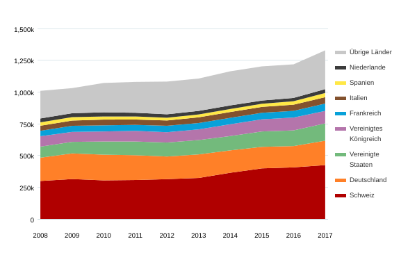</a>
- **befragungen001** – Umfrageergebnisse als absolute Zahlen:<br>
  <a href="https://statabs.github.io/indikatoren/chart-details.html?id=6266" target="_blank">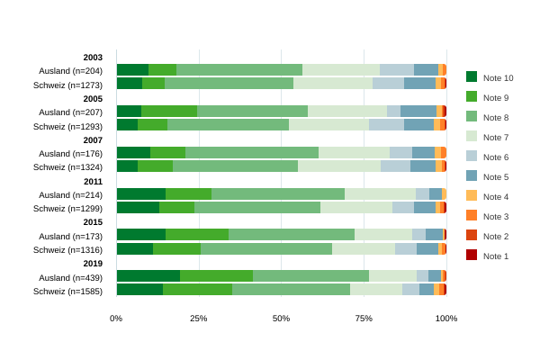</a>
- **befragungenProzent001** – Umfrageergebnisse in Prozent:<br>
  <a href="https://statabs.github.io/indikatoren/chart-details.html?id=5821" target="_blank">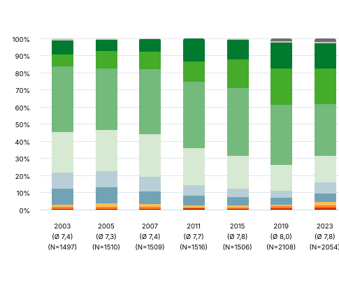</a>
- **bubble001**:<br>
  <a href="https://statabs.github.io/indikatoren/chart-details.html?id=6549" target="_blank">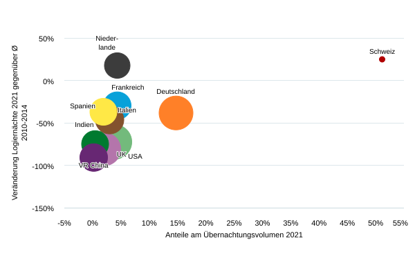</a>
- **dotplot**:<br>
  <a href="https://statabs.github.io/indikatoren/chart-details.html?id=4839" target="_blank">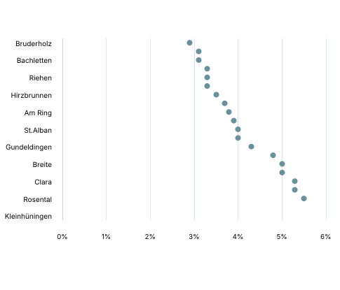</a>
- **line001**:<br>
  <a href="https://statabs.github.io/indikatoren/chart-details.html?id=5813" target="_blank">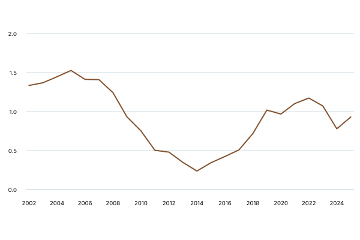</a>
- **map001** – Wohnviertel-Choroplethenkarte mit Rängen aus der Datendatei im Tooltip:<br>
  <a href="https://statabs.github.io/indikatoren/chart-details.html?id=5109" target="_blank">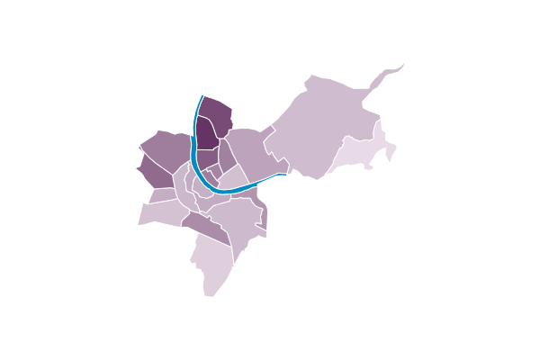</a>
- **map002** – einfache Wohnviertel-Choroplethenkarte ohne Ränge, mit einfachem Tooltip:<br>
  <a href="https://statabs.github.io/indikatoren/chart-details.html?id=9999" target="_blank">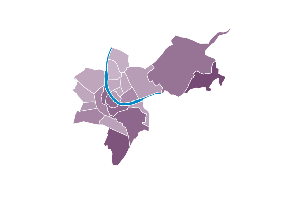</a>
- **mapcolumn002**:<br>
  <a href="https://statabs.github.io/indikatoren/chart-details.html?id=6022" target="_blank">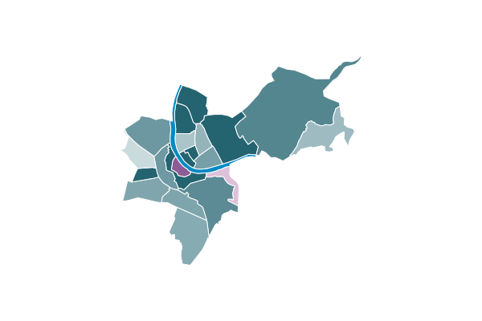</a>
- **mappie001** – Kreise/Kuchendiagramme auf einer Karte:<br>
  <a href="https://statabs.github.io/indikatoren/chart-details.html?id=6009" target="_blank">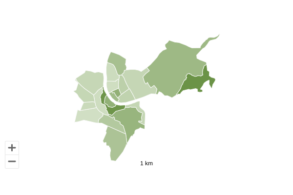</a>
- **pie001**:<br>
  <a href="https://statabs.github.io/indikatoren/chart-details.html?id=6013" target="_blank">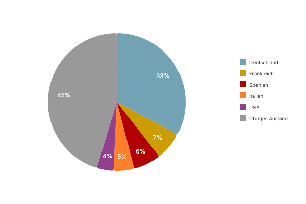</a>
- **populationPyramid001**:<br>
  <a href="https://statabs.github.io/indikatoren/chart-details.html?id=6018" target="_blank">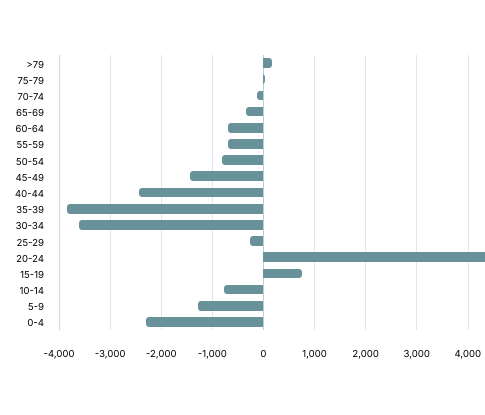</a>
- **spider001** – Netz-/Radardiagramm ("Quartierradar"):<br>
  <a href="https://statabs.github.io/indikatoren/chart-details.html?id=6630" target="_blank">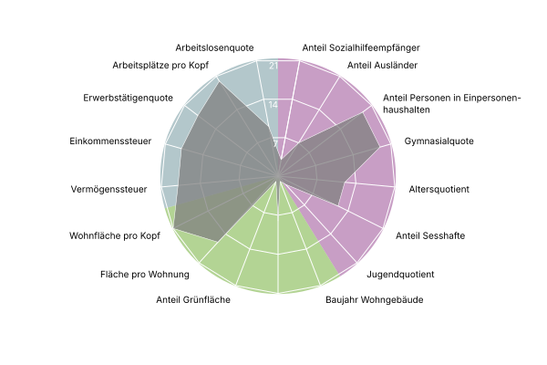</a>
- **stock001** – Zeitachse mit Mini-Chart zum Filtern, z. B. 4132:<br>
  <a href="https://statabs.github.io/indikatoren/chart-details.html?id=4132" target="_blank">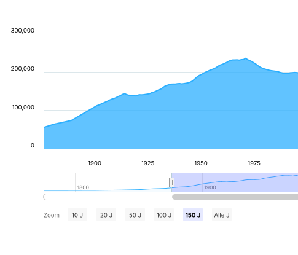</a>
- **template001** – Allzweck-Template; die meisten Balken-, Säulen- und Kombinationscharts basieren darauf:<br>
  <a href="https://statabs.github.io/indikatoren/chart-details.html?id=6011" target="_blank">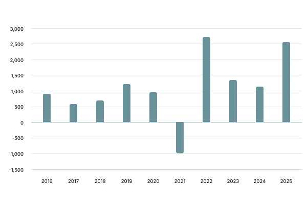</a>

## Anwendung lokal bauen

Metadaten-Datenbanken, Chart-Konfigurationen und SVG-Vorschaubilder aller **seit dem letzten Build geänderten** Charts neu erzeugen:

```shell
npm run build
```

Alles neu bauen, unabhängig von Änderungen:

```shell
npm run rebuild
```

Statt eines vollständigen Builds können auch gezielt einzelne Indikatoren neu gebaut werden: gewünschte IDs in `tmp/chartsToBuild.json` eintragen (z. B. `["6630","6631"]`), dann:

```shell
npm run build:charts
npm run build:images
```

## Was macht der Build-Prozess?

- **`build:database`** – Erstellt die Metadaten-Datenbanken für die Portal-Ansicht: liest jede Datei `metadata/single/[id].json`, ermittelt Sichtbarkeit (`visible`) und Portal-Sichtbarkeit (`visibleInPortal`), schreibt sichtbare Indikatoren nach `metadata/all/indikatoren.json`, portal-sichtbare nach `metadata/portal/indikatoren.json`. Erzeugt zudem `metadata/all/kuerzelById.json`, `idByKuerzel.json`, `templatesById.json` und `all.md` als menschenlesbare Nachschlagehilfen.
- **`build:find_changed_charts`** – Vergleicht Prüfsummen von `data/`, `metadata/single/`, `charts/templates/` mit dem Stand des letzten Builds (`metadata/all/hashesAfterBuild.json`) und trägt geänderte IDs in `tmp/chartsToBuild.json` ein.
- **`build:partial_databases`** – Erstellt pro Kennzahlenset eine JSON-Datenbank unter `metadata/sets/[kennzahlenset].json`, die in der Indikatorenset-Ansicht anstelle der grösseren Datei `metadata/portal/indikatoren.json` geladen wird.
- **`build:charts`** – Erzeugt für jeden Chart in `tmp/chartsToBuild.json` die zusammengeführte Highcharts-Konfiguration `charts/configs/portal/[id].json` aus `data/[id].tsv`, `metadata/single/[id].json`, `charts/templates/[id].js` und dem zugehörigen Basis-Template.
- **`build:images`** – Erzeugt für jeden Chart in `tmp/chartsToBuild.json` das Vorschaubild `images/portal/[id].svg` aus der jeweiligen Highcharts-Konfiguration (via `highcharts-export-server`). Bei Karten-Charts werden Legende, Zoom-Buttons und Massstabsleiste für die Vorschau ausgeblendet.
- **`build:images_viewbox`** – Ergänzt die generierten SVGs um ein `viewBox`-Attribut für eine saubere Darstellung.
- **`build:optimize_images`** – Optimiert die SVG-Dateien (kleinere Dateigrösse).
- **`build:save_checksums`** – Speichert Prüfsummen aller Dateien in `metadata/all/hashesAfterBuild.json`, damit `build:find_changed_charts` beim nächsten Lauf Änderungen erkennt.
- **`build:copy_modules`** – Kopiert die für die Live-Website benötigten npm-Module (siehe `package.json`, Schlüssel `dependencies`) nach `assets/js/modules`.
- **`build:copy_data_per_set`** – Kopiert TSV-Dateien in einen nach Kennzahlenset benannten Ordner (`data/sets/[kennzahlenset]/[id].tsv`).
- **`deployNewCharts`** – Lädt Daten, Metadaten und Konfiguration für Charts herunter, die laut FTP-Server bereit zur Aktualisierung sind (siehe [Charts vom FTP-Server aktualisieren](#charts-vom-ftp-server-aktualisieren)).

## Charts vom FTP-Server aktualisieren

```shell
npm run deployNewCharts
npm run build
```

Danach wie gewohnt bauen, committen und pushen.

## Charts aus dem "Umweltbericht beider Basel" übernehmen

1. In der Indikatoren-App (Access) unter "Spezialtabellen" → "Umweltbericht Indikatoren": "Metadaten einlesen" (holt Metadaten aller Indikatoren von der UB-Webseite), dann "Metadaten abgleichen" (importiert die Metadaten in die lokale Indikatoren-DB).
2. Alle betroffenen Indikatoren auf Status "Bereit für Live" setzen und "publizieren", um die JSON-Dateien mit korrektem "zuletzt geändert"-Datum zu exportieren.
3. GitHub: neues [Issue](https://github.com/statabs/indikatoren/) und dazugehörigen Branch anlegen.
4. Branch auschecken, Metadaten (JSON) und TSV-Dateien (nur für Indikatoren, deren Daten nicht aus dem Umweltbericht übernommen werden) wie oben beschrieben in den Branch kopieren.
5. Ausführen:
   ```shell
   npm run build:create_umwelt_charts
   npm run build:clean_umwelt_charts
   ```
   Dies öffnet mit CasperJS/PhantomJS alle Charts des Kennzahlensets "Umwelt" und speichert ihre Highcharts-Konfiguration in `charts/configs/portal`. Ist `datenInChartIntegriert` eines Umwelt-Charts:
   - `false`: wird die Highcharts-Konfiguration bereinigt und als `charts/templates/[id].js` gespeichert (ermöglicht die Verwendung mit extern bereitgestellten, manuell hochgeladenen TSV-Daten – Standardverhalten für alle anderen Indikatoren).
   - `undefined` oder `true`: wird die TSV-Datei von der UB-Website heruntergeladen und als `data/[id].tsv` gespeichert (ermöglicht das Abrufen der TSV-Datei über das Highcharts-Hamburger-Menü).
6. SVG-Dateien erzeugen:
   ```shell
   npm run build
   ```
7. Lokalen Server starten und [alles prüfen](http://127.0.0.1:8084/?Indikatorenset=Umwelt).
8. Committen, pushen.
9. Branch-/Issue-Nummer aller Indikatoren des Umwelt-Sets in der StatApp ergänzen, dort Status auf "Bereit für Live" setzen.
10. Git-Admin über das Update informieren.

## PNG/PDF-Export pro Indikatorenset

- In Chrome `print.html?Indikatorenset=indikatorensetname` bzw. `print.html?Indikatorenset=indikatorensetname&type=pdf` öffnen.
  - Parameter `view` steuert, ob der Indikator-Titel enthalten ist:
    - `view=print`: kein Titel
    - `view=portal`: Titel
    - `view=indikatorenset`: Nummer und Titel
- Chrome lädt für jeden Chart des Indikatorensets eine PNG-/PDF-Datei in den lokalen Downloads-Ordner herunter; von dort manuell in den Zielordner verschieben.
- Verwendet einen [Highcharts Node.js Export Server](https://github.com/highcharts/node-export-server), der auf dem StatA-Server `pdstatasvpapp05` (`highcharts-export.stata.pd.intranet.bs.ch`) läuft.
- Einzelne Charts in der Druckansicht prüfen: `chart.html?view=print&id=5824`.
- Einzelnen Chart als PNG/PDF herunterladen: `chart.html?thumbnailOfflineExporting=false&thumbnailType=png&view=print&exportServer=https://highcharts-export.stata.pd.intranet.bs.ch/&id=[chart-id]&thumbnailType=[pdf/png]`.

## Vorschaubilder manuell erzeugen

- Portal-Ansicht: `thumbnails.html` in Chrome öffnen.
- Indikatorenset-Ansicht: `thumbnails.html?view=indikatorenset` öffnen.

Lädt alle SVG-Dateien in den lokalen Downloads-Ordner herunter; von dort manuell in den jeweiligen Zielordner unter `/images/` verschieben.

## URL-Parameter

Die meisten der folgenden Parameter lassen sich kombinieren. `?` trennt Server/Dokument von der Parameterliste, `&` trennt weitere Parameter. Filter-Parameter funktionieren auch, wenn das zugehörige Filterelement ausgeblendet ist. Die URL-Kodierung der Parameterwerte übernimmt der Browser automatisch.

| Parameter | Ansicht | Beispiel | Standard | Beschreibung |
| --- | --- | --- | --- | --- |
| `Indikatorenset` | Indikatorenset | [Beispiel](https://statabs.github.io/indikatoren/?Indikatorenset=Wohnviertel) | – | Wechselt in die Indikatorenset-Ansicht: blendet Seitenleiste, Thema- und Räumliche-Gliederung-Filter aus, ergänzt Filter für Stufe 1 und Stufe 2. Zusätzlich wird `kuerzelKunde` statt `kuerzel` angezeigt. |
| `stufe` | Indikatorenset | [Beispiel](https://statabs.github.io/indikatoren/?Indikatorenset=Arbeitsmarkt&stufe=3) | 2 | Legt die maximale Stufe ("Kapitel"/"Unterkapitel") fest, die als Dropdown-Filter angezeigt wird. |
| `showHeader` | Portal | [Beispiel](https://statabs.github.io/indikatoren/?showHeader=true) | false | Zeigt den Kopfbereich mit bs.ch-Logo, StatA-Schriftzug und Link zum Indikatorenportal. |
| `PerPage` | Portal, Indikatorenset | [Beispiel](https://statabs.github.io/indikatoren/?PerPage=32) | 16 | Anzahl der pro Seite angezeigten Charts. |
| `search` | Portal, Indikatorenset | [Beispiel](https://statabs.github.io/indikatoren/?search=nominal) | – | Befüllt das Volltextsuchfeld vor. |
| `thema` | Portal, Indikatorenset | [Beispiel](https://statabs.github.io/indikatoren/?thema=14%20Gesundheit) | – | Befüllt den Thema-Filter vor. |
| `unterthema` | Portal, Indikatorenset | [Beispiel](https://statabs.github.io/indikatoren/?thema=14%20Gesundheit&unterthema=Spit%C3%A4ler) | – | Befüllt den Unterthema-Filter vor. |
| `raeumlicheGliederung` | Portal, Indikatorenset | [Beispiel](https://statabs.github.io/indikatoren/?raeumlicheGliederung=Kanton) | – | Befüllt den Filter für die räumliche Gliederung vor. |
| `darstellungsart` | Portal, Indikatorenset | [Beispiel](https://statabs.github.io/indikatoren/?darstellungsart=Karte) | – | Befüllt den Darstellungsart-Filter vor. |
| `stufe1`, `stufe2`, `stufe3` | Portal, Indikatorenset | [Beispiel](https://statabs.github.io/indikatoren/?Indikatorenset=Arbeitsmarkt&stufe=3&stufe1=Monitoring%20Basler%20Arbeitsmarkt&stufe2=Bruttoinlandprodukt%20und%20Wertsch%C3%B6pfung) | – | Befüllt die Filter für Stufe 1, Stufe 2 und Stufe 3 vor. |
| `sort` | Portal, Indikatorenset | [Beispiel](https://statabs.github.io/indikatoren/?sort=aktualisierungsdatum_desc) | orderKey_asc | Sortiert Charts nach einer Metadaten-Eigenschaft. Unterstützt aktuell `kuerzel`, `kuerzelKunde`, `orderKey`, `aktualisierungsdatum`. |
| `hideSidebar` | Portal | [Beispiel](https://statabs.github.io/indikatoren/?hideSidebar=true) | false | Blendet die Seitenleiste (Volltextsuche, Reset-Button, Thema- und Räumliche-Gliederung-Filter) aus. |
| `hideSearch` | Portal | [Beispiel](https://statabs.github.io/indikatoren/?hideSearch=true) | false | Blendet das Volltextsuchfeld aus. |
| `hideResetButton` | Portal | [Beispiel](https://statabs.github.io/indikatoren/?hideResetButton=true) | false | Blendet den Filter-Reset-Button aus. |
| `hideThema` | Portal | [Beispiel](https://statabs.github.io/indikatoren/?hideThema=true) | false | Blendet den Thema-Filter aus. |
| `hideUnterthema` | Portal | [Beispiel](https://statabs.github.io/indikatoren/?hideUnterthema=true) | false | Blendet den Unterthema-Filter aus. |
| `hideRaeumlicheGliederung` | Portal | [Beispiel](https://statabs.github.io/indikatoren/?hideRaeumlicheGliederung=true) | false | Blendet den Filter für die räumliche Gliederung aus. |
| `hideDarstellungsart` | Portal | [Beispiel](https://statabs.github.io/indikatoren/?hideDarstellungsart=true) | false | Blendet den Darstellungsart-Filter aus. |
| `showLastUpdatedSets` | Portal | [Beispiel](https://statabs.github.io/indikatoren/?Indikatorenset=Arbeitsmarkt&showLastUpdatedSets=true) | false | Zeigt die Tabelle der zuletzt aktualisierten Indikatorensets. |
| `id` | chart-details.html | [Beispiel](https://statabs.github.io/indikatoren/chart-details.html?id=2401) | – | Legt die ID des anzuzeigenden Charts fest. |
| `hideHeader` | chart-details.html | [Beispiel](https://statabs.github.io/indikatoren/chart-details.html?id=2401&hideHeader=true) | false | Blendet den Kopfbereich (bs.ch-Logo, StatA-Schriftzug, Link zum Indikatorenportal) aus, verringert den linken Abstand. Bei `false` wird der Inhalt zusätzlich in einen `.container` eingefasst (eigenständige Nutzung). |
| `hideTitle` | chart-details.html | [Beispiel](https://statabs.github.io/indikatoren/chart-details.html?id=2401&hideTitle=true) | false | Blendet den Chart-Titel im HTML-Text unterhalb des Charts aus. |
| `hideLesehilfe` | chart-details.html | [Beispiel](https://statabs.github.io/indikatoren/chart-details.html?id=2401&hideLesehilfe=true) | false | Blendet Titel und Text der Lesehilfe aus. |
| `hideLesehilfeTitle` | chart-details.html | [Beispiel](https://statabs.github.io/indikatoren/chart-details.html?id=2401&hideLesehilfeTitle=true) | false | Blendet den Lesehilfe-Titel aus, lässt aber den Text stehen. |
| `hideErlaeuterungen` | chart-details.html | [Beispiel](https://statabs.github.io/indikatoren/chart-details.html?id=2401&hideErlaeuterungen=true) | false | Blendet Titel und Text der Erläuterungen aus. |
| `hideErlaeuterungenTitle` | chart-details.html | [Beispiel](https://statabs.github.io/indikatoren/chart-details.html?id=2401&hideErlaeuterungenTitle=true) | false | Blendet den Erläuterungen-Titel aus, lässt aber den Text stehen. |
| `hideLinks` | chart-details.html | [Beispiel](https://statabs.github.io/indikatoren/chart-details.html?id=2401&hideLinks=true) | false | Blendet Titel und Liste der Links aus. |
| `hideLinksTitle` | chart-details.html | [Beispiel](https://statabs.github.io/indikatoren/chart-details.html?id=2401&hideLinksTitle=true) | false | Blendet den Links-Titel aus, lässt aber die Liste stehen. |

## Bekannte Highcharts-12-Kompatibilitätsthemen

Das Projekt wurde von einer älteren Highcharts-Version auf Highcharts 12 migriert. Einige Templates verwenden noch API-Muster, die es in dieser Form nicht mehr gibt. Damit ältere Chart-Templates trotzdem unverändert funktionieren, patcht `assets/js/indikatoren-highcharts.js` beim Laden global:

- **`series.yData` / `series.xData`** – in Highcharts 12 durch `series.getColumn('y')`/`getColumn('x')` ersetzt; wird per `Object.defineProperty` als Getter nachgebildet.
- **`axis.names` / `Tick.addLabel`** – `axis.names` kann bei manchen Achsen (z. B. Navigator) undefined sein; wird per `afterInit`-Event auf `[]` initialisiert. `Tick.addLabel` ist zusätzlich mit try/catch abgesichert, damit ein fehlerhafter Label-Formatter nur das eine Tick-Label statt den gesamten Chart zum Absturz bringt.
- **`chart.events.load` / `chart.events.render` mit "Wrapper"-Pattern** – Wenn `indikatoren-highcharts.js` einen bestehenden `load`- oder `render`-Handler "einpackt" (um z. B. Legenden nachträglich zu positionieren), wird der ursprüngliche Handler **nicht** in einer Closure-Variable gespeichert, sondern als Property (`options.chart.events.loadBase` bzw. `renderBase`) auf dem serialisierbaren Options-Objekt abgelegt. Grund: `build/createChartConfigs.js` serialisiert Funktionen nur als reinen Quelltext – eine Referenz auf eine Closure-Variable geht dabei verloren und wirft beim erneuten Auswerten (z. B. während des Vorschaubild-Exports) einen `ReferenceError`, wodurch der komplette ursprüngliche Handler stillschweigend übersprungen wird.
- **`mappie`-Serien (Kreise/Kuchendiagramme auf Karten)** – positionieren sich über `chart.mapView.projectedUnitsToPixels()` statt über die früher verwendeten `chart.xAxis[0].toPixels()`/`chart.yAxis[0].toPixels()`, die bei Karten-Charts in Highcharts 12 keine gültigen Werte mehr liefern.

Wer ein neues Chart-Template auf Basis eines alten Beispiels erstellt: Diese Muster nach Möglichkeit meiden bzw. bei Problemen mit fehlenden Chart-Elementen (insbesondere in exportierten Vorschaubildern, aber ohne sichtbaren Fehler) zuerst hier nachschauen.

## Abhängigkeiten aktualisieren

Versionsnummern in `package.json` anpassen, danach für eine saubere Neuinstallation:

```shell
npm run reinstall
```

## Entwicklung in einem privaten GitHub-Repository

- Im privaten Repository wie gewohnt entwickeln: Issue anlegen, Branch `issue-XXX` erstellen (XXX = Issue-Nummer).
- Sobald die neue Funktionalität ins öffentliche Repository übernommen werden soll:
  - Im privaten Repo das öffentliche Repo als Remote `upstream` definieren (korrekte HTTPS-URL verwenden):
    ```shell
    git remote add upstream https://github.com/user/indikatoren.git
    ```
  - Änderungen wie gewohnt committen und ins private Repo pushen.
  - Branch mit gleichem Namen im öffentlichen Repository (`upstream`) anlegen.
  - Neueste Commits vom öffentlichen in den privaten Branch holen:
    ```shell
    git checkout issue-XXX
    git pull upstream issue-XXX
    ```
  - Bei Konflikten (gemeinsame Dateien in beiden Branches geändert): manuell auflösen, dann committen und ins private Repo pushen:
    ```shell
    git add .
    git commit -m "Merge upstream"
    git push
    ```
  - Änderungen in den Branch `issue-XXX` des öffentlichen Repos pushen:
    ```shell
    git push upstream issue-XXX
    ```

## Entwicklung mit Cloud9

- Neuen gehosteten Workspace basierend auf dem Node.js-Template und dem korrekten GitHub-Repo erstellen (SSH-Repo-Pfad verwenden).
- Folgenden Befehl ausführen (setzt Node.js-Version auf 6, installiert TrueType-Fonts und die Anwendung):
  ```shell
  ./c9-setup.sh
  ```
- Bash-Terminal schliessen und ein neues öffnen (Plus-Symbol → "New Terminal").
- Im Terminal ausführen:
  ```shell
  npm run reinstall
  ```
- Anwendung in Cloud9 starten: "Run" → "New Run Configuration…" → "Runner" → "Apache httpd" wählen, Feld "Run Config Name" mit z. B. "Apache httpd" benennen. "Run" klicken, danach die im Konsolen-Log angezeigte URL öffnen: `https://<c9-vm-name>-<c9-username>.c9users.io`.
- Um diese Runner-Konfiguration zur Standardkonfiguration zu machen: Rechtsklick auf den grünen "Run"-Button → "Manage…" → "Set as Default". Ab dann wird dieser Runner bei jedem Klick auf den grünen "Run"-Button verwendet.

## Lizenzierung

[Highcharts](http://www.highcharts.com/) ist für private, schulische oder Non-Profit-Projekte unter der Creative-Commons-Lizenz "Attribution – Non Commercial 3.0" kostenlos.
Für kommerzielle und behördliche Websites/Projekte ist eine Lizenz erforderlich, siehe [License and Pricing](http://shop.highsoft.com/highcharts.html).
